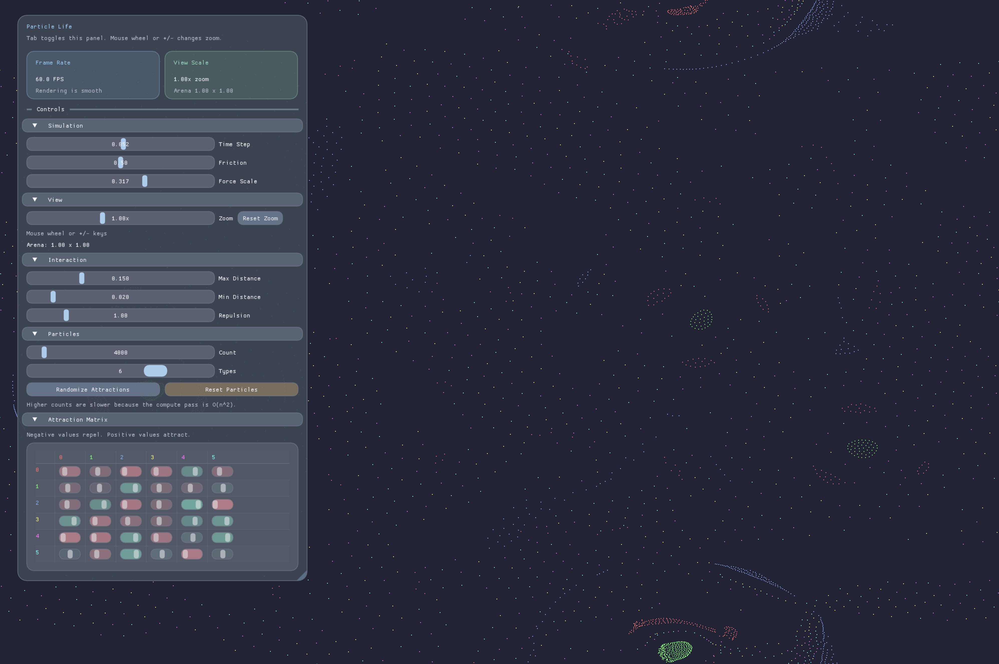

<div class="hero">
  <p class="hero-kicker">$ boot particle-life-engine</p>
  <h1>Particle Life Engine</h1>
  <p class="hero-lead">
    GPU-accelerated particle life simulation built on Vulkan compute shaders.
    The system pushes thousands of particles through attraction and repulsion
    fields to produce emergent, life-like motion in real time.
  </p>
</div>



## What This Project Is

Particle Life Engine is a native C++17 application that combines:

- Vulkan compute passes for particle interaction updates
- Vulkan graphics passes for rendering
- ImGui controls for live simulation tuning
- A configurable attraction matrix across multiple particle types

The codebase is organized around a few core systems:

| System | Responsibility |
| --- | --- |
| `Application` | Main loop, input, UI, and frame orchestration |
| `VulkanContext` | Instance, device, swapchain, synchronization, and command plumbing |
| `ParticleSystem` | Particle buffers, simulation parameters, and attraction matrix state |
| `ComputePipeline` | Compute shader execution for simulation updates |
| `GraphicsPipeline` | Rendering particles to the swapchain |

## Quick Start

```bash
cmake -B build -DCMAKE_BUILD_TYPE=Release
cmake --build build --parallel
./build/particle-life-engine
```

On Windows use `build\Release\particle-life-engine.exe`.

## Key Capabilities

- Up to `50000` simulated particles
- Up to `8` particle types with pairwise interaction coefficients
- Toroidal world wrapping
- Runtime parameter tweaking through the UI
- Cross-platform build workflow for Linux, macOS, and Windows

## Docs Map

- [Getting Started](getting-started.md) covers prerequisites, build, run, and Docker usage.
- [Architecture](architecture.md) explains the runtime structure and render loop.
- [Simulation Model](simulation.md) describes the particle data model and interaction rules.
- [Development](development.md) covers testing, repo layout, and the docs workflow itself.
